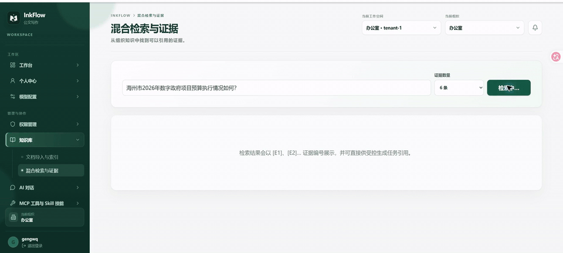
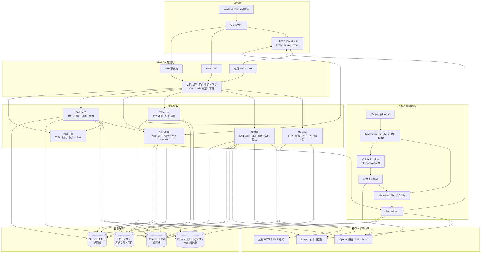
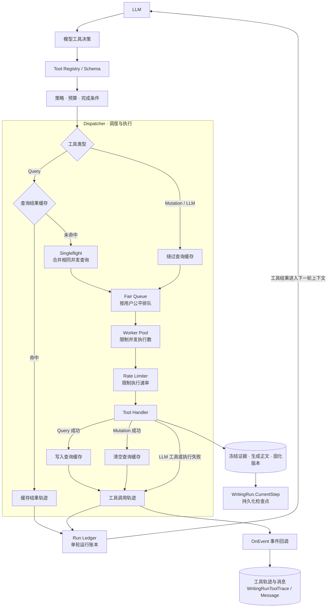

# InkFlow

InkFlow 是一个面向组织协作的公文写作与知识库系统。它把资料导入、文档解析、混合检索、证据引用、受控生成、版本审阅和 AI 对话放在同一套租户与组织权限边界中，同时支持 Web 服务端和 Windows 桌面客户端。

> 当前仓库是脱敏后的公开代码快照。运行配置、密钥、业务资料、真实业务测试数据和 `docs/` 均不在仓库中；`eval/` 仅包含可公开的合成公文任务与实测汇总。

## 功能演示

[](assets/demo/inkflow-core-features.mp4)

[观看或下载 MP4 演示视频](assets/demo/inkflow-core-features.mp4)（约 2 分钟，无声）。视频使用虚构测试资料，展示混合检索与证据引用、AI 对话中手动选择 Skill，以及受控写作的工具轨迹和版本化文稿。

## 核心能力

### 组织、权限与安全

- 多租户、组织树、成员申请与审核、角色、菜单权限、API 权限和审计日志。
- 基于 Casbin 域模型的租户与组织权限校验；知识检索、写作任务和文件下载均按租户、组织、成员关系过滤。
- 本地密码登录、OAuth 2.0、HttpOnly 会话 Cookie、登录限流、验证码和 TOTP MFA。
- 用户级模型连接配置。API Key、MCP Bearer Token 等凭据不会通过查询接口返回明文；服务端无系统凭据管理器时使用部署密钥加密保存。

### 知识库与检索

- 导入 Markdown、DOCX、XLSX、PPTX 和 PDF，单文件上限 200 MB。
- PDF 优先通过 Poppler 提取正文；DOCX、XLSX、PPTX 直接解析 OOXML，并统一规范化为 Markdown。
- 使用 ONNX Runtime 与 `PP-DocLayout-S` 检测图片中的文字、表格、标题、公式和图表区域；命中后可调用用户配置的视觉模型提取文字或生成结构摘要。
- 文档上传后进入后台处理，前端通过 SSE 展示解析、图片处理、切片和索引进度；失败文档可以重新解析或重建索引。
- 向量召回与词法召回各自获取候选，去重后统一交给 Rerank 排序。单次候选总量最多 24 条，不使用手写分数代替重排。
- PostgreSQL 部署使用 pgvector；桌面 SQLite 使用 FTS5 与 USearch HNSW。
- 原始文件和嵌入图片保存在私有 OSS，下载前由后端校验成员身份并生成短时签名地址。

### 受控写作

- 组织级 Markdown 写作模板，支持用途说明、变量和约束。
- 写作任务明确区分大纲与草稿生成；每次模型生成或人工保存都会创建不可变版本。
- 写作运行通过受限工具完成证据检索、文稿生成和版本固化，并持久化消息、工具轨迹、检查点和证据快照。
- 长任务可以暂停、恢复，并通过 SSE 查看运行状态；服务重启后可以从未完成步骤继续。
- 支持版本差异、规则校验、敏感词检查、版本批注与批注处理。
- 支持导出 Markdown、DOCX 和 PDF；PDF 导出需要运行环境提供 LibreOffice。

### AI 对话、Skill 与 MCP

- AI 对话使用当前用户配置的 OpenAI Chat Completions 兼容模型，并通过 SSE 流式返回内容与工具轨迹。
- 每轮携带最近 8 条消息，并从当前会话中召回相关的完整历史问答，再通过 Rerank 选择长期上下文。
- Skill 支持自动匹配、手动选择和关闭；只有本轮选中的 Skill 指令会进入系统提示词。
- MCP 仅连接用户显式配置并启用的远程 HTTPS Streamable HTTP 服务，不启动本机进程，也不开放执行本地命令的入口。
- 模型只能看到本轮实际发现的 MCP 工具；工具返回值按不可信外部内容处理。

### 推理方式

- 服务端可以连接用户配置的 OpenAI 兼容模型服务。
- Windows 桌面版可以使用内置 llama.cpp 后端运行 Chat、Embedding 和 Rerank，并提供 CPU、CUDA、Vulkan 构建路径。
- 前端支持 WebGPU Embedding/Rerank worker，通过受保护的 WebSocket 通道与后端协作。

## 系统架构



### 工具编排执行链

下面这张小图对应当前受控写作工具的实际执行路径。`RunLedger` 是单次编排运行的内存账本；写作运行同时通过事件回调把工具轨迹、消息和证据写入数据库，并以 `WritingRun.CurrentStep` 作为可恢复检查点。



查询缓存键由当前用户、工具名和参数共同生成；相同查询的并发未命中由 `singleflight` 合并。Mutation 工具不会读取或写入查询缓存，只有执行成功后才会清空查询缓存。所有实际工具调用仍需经过公平队列、工作协程池和全局限流器。

### 核心实现

- [Agent Orchestrator](utils/toolchain/orchestrator/orchestrator.go)
- [Tool Registry](utils/toolchain/orchestrator/registry.go)
- [Tool Dispatcher](utils/toolchain/executor/dispatcher.go)
- [Durable Writing Run](service/officialdoc/writing_run.go)
- [Hybrid Knowledge Search](service/officialdoc/knowledge_search.go)
- [Agent Eval](eval/README.md)

主业务链路如下：

```text
导入文件 → 后台解析 → 图片版面检测/视觉提取 → Markdown 规范化
        → 切片 → Embedding/词法索引 → 混合召回 → Rerank
        → 冻结证据 → 受控生成 → 不可变版本 → 校验/批注/导出
```

## 技术栈

| 层级 | 实现 |
| --- | --- |
| 前端 | Vue 3、Vite、TipTap、Markdown-It、Transformers.js / WebGPU |
| 桌面端 | Wails 2、WebView2、本地 Gin loopback 服务 |
| 后端 | Go 1.25、Gin、GORM、Casbin |
| 模型 | OpenAI 兼容接口、llama.cpp、浏览器 WebGPU |
| 文档 | OOXML、Excelize、Poppler、ONNX Runtime、PP-DocLayout-S |
| 检索 | pgvector、SQLite FTS5、USearch HNSW、Rerank |
| 存储 | PostgreSQL 或 SQLite、私有阿里云 OSS |
| 协议 | REST、SSE、WebSocket、MCP Streamable HTTP |

## Docker 快速启动

Docker 是当前最直接的 Web 部署方式。构建阶段需要访问 Go/npm 依赖源，以及 ONNX Runtime 和版面模型的下载地址。

### 1. 准备配置

```bash
cp config.docker.example.yaml config.docker.yaml
```

按实际环境编辑 `config.docker.yaml`，至少配置 OSS。该文件已被 `.gitignore` 忽略，不应提交：

```yaml
oss:
  endpoint: "oss-cn-example.aliyuncs.com"
  bucket: "your-private-bucket"
  region: "cn-example"
  access-key-id: "your-access-key-id"
  access-key-secret: "your-access-key-secret"
```

### 2. 准备部署密钥

```bash
cp /dev/null .env
printf 'POSTGRES_PASSWORD=%s\n' "$(openssl rand -hex 24)" >> .env
printf 'INKFLOW_AUTH_JWT_SECRET=%s\n' "$(openssl rand -hex 32)" >> .env
```

`.env` 同样不会被 Git 跟踪。`INKFLOW_AUTH_JWT_SECRET` 同时用于会话签名和服务端凭据加密，生产环境必须稳定保存；更换它后，已有加密凭据将无法解密。

### 3. 启动

```bash
docker compose up -d --build
```

默认访问地址为 `http://localhost:8080`，后端容器监听 `8888`，健康检查路径为 `/health`。

查看状态和日志：

```bash
docker compose ps
docker compose logs -f --tail=200 inkflow
```

停止服务：

```bash
docker compose down
```

数据库使用命名卷 `postgres-data`。如果需要连同数据库一起删除，必须明确执行 `docker compose down -v`。

## 本地开发

### 前端

```bash
cd web
npm ci
npm run dev
```

### 后端

后端需要 Go 1.25、CGO 工具链，以及与目标平台匹配的 USearch/llama.cpp/ONNX Runtime 构建产物。服务端启动时从仓库根目录读取 `config.yaml`：

```bash
cp config.example.yaml config.yaml
go run .
```

如果只开发 Web 服务，建议直接使用 Docker，避免在宿主机重复准备本地推理依赖。

### Windows 桌面端

桌面版通过 Wails 启动 Vue 页面和随机 loopback Gin 服务。构建机需要 Windows x64、Go 1.25、Node.js、CMake、Ninja、Visual Studio 2022 Build Tools、Inno Setup 6 和 WebView2 Runtime。

```powershell
.\scripts\setup_usearch.ps1
.\scripts\build_installer.ps1 -Version 0.1.0 -InferenceProvider local -Backend cpu
```

也可以将 `-Backend` 改为 `cuda` 或 `vulkan`；对应构建机和运行机必须具备相应 SDK、驱动及运行库。桌面运行数据默认保存在 `%LOCALAPPDATA%\InkFlow`，升级不会覆盖用户配置和数据库。

## Agent Eval 与本机性能

[`eval/README.md`](eval/README.md) 定义了可复现的 `public-office-v2` 评测：20 个公文主题 × 检索、摘要、起草、改写、Tool Call、引用六类，共 **120 条任务**、40 个合成证据片段。任务分别保存用户问题 `user_prompt` 与系统约束 `system_instruction`；默认检索 Embedding 只接收用户问题。计分器输出 Retrieval Recall@K、Rerank 命中率、Tool Call 成功率、Citation Accuracy 和 Task Success Rate，保留分子、分母；未执行的指标显示 N/A。

2026-10-08 在 Windows 主机（Intel i9-13900HX，24 核/32 线程，32 GiB RAM，NVIDIA RTX 4060 Laptop GPU、8188 MiB 显存）上执行了其中 **20 条检索任务**。使用 40 个公开合成片段，写入独立 SQLite `knowledge_chunks` 表，按桌面端 HNSW 默认参数保存 USearch 索引，关闭并重载数据库和索引后，再调用 Qwen3 Embedding 0.6B Q4 向量检索与 BGE-M3 Rerank Q4。逐任务输出、计分报告和索引校验分别在 [`eval/results/retrieval-eval-cuda.jsonl`](eval/results/retrieval-eval-cuda.jsonl)、[`eval/results/retrieval-eval-cuda-report.json`](eval/results/retrieval-eval-cuda-report.json)、[`eval/results/retrieval-eval-cuda-validation.json`](eval/results/retrieval-eval-cuda-validation.json)。本项仍是向量检索分层评测，没有经过正式知识库的 FTS5 混合召回、权限过滤及 Chat Agent。

| 指标 | 本次结果 | 样本 |
| --- | ---: | ---: |
| Retrieval Recall@1 / @3 / @5 / @10 | 50.0% / **100.0%** / 100.0% / 100.0% | 20 条检索任务，40 个 gold 片段 |
| Rerank 命中率@1 / @3 / @5 / @10 | **100.0%** / 100.0% / 100.0% / 100.0% | 20 条检索任务；包含上游未召回的影响 |
| Tool Call 成功率 / Citation Accuracy / Task Success Rate | **N/A** | 尚未接入 Chat Agent 与答案评审，100 条非检索任务未执行 |

索引校验确认 SQLite 与重载后的 USearch 各有 40 条记录；从 SQLite 读回的 40 条向量、从 USearch 读回的 40 条向量均与模型输出逐维一致（最大绝对差均为 0）。40/40 条原向量自查询排第 1，20 次问题查询的 USearch Top10 与精确余弦 Top10 集合重合 **200/200**。本次索引为 1024 维、余弦距离、F32、HNSW M=32、efConstruction=256、efSearch=64。评测保留的文件位于 `eval/.local/retrieval-*/inkflow-eval.db` 和同目录的 `officialdoc_knowledge_chunks.usearch`。本地 llama.cpp Embedding 遵循 Qwen3 GGUF 的 LAST pooling、模型默认的因果注意力，并为每个 token 传入实际位置。尚未对模型输出与另一推理框架进行逐维交叉验证。

检索任务只将用户问题送入 Embedding；工具调用、引用和格式要求作为独立的系统约束。该语料只有 40 条结构相近的合成片段，本次结果不能外推为真实知识库或 120 条端到端 Agent 任务的准确率。完整逐题结果见 [`eval/results/`](eval/results/)。

同一主机另用固定种子的 **100,000 条 × 384 维合成向量**建立 USearch HNSW 索引，查询 1,000 次、Top10：建索引 104.013 s；检索 **P50 1.199 ms / P95 2.285 ms**；向量自查询 Recall@10 **92.0%**；USearch 报告索引内存 **273.338 MiB**。它衡量向量索引性能，不能当作公文语义检索准确率。原始结果在 [`eval/results/retrieval-100k-windows.json`](eval/results/retrieval-100k-windows.json)。

本地模型均使用相同合成文本，先热身 1 次，再测 Embedding 20 条或 Rerank 10 轮 × 8 文档；P50/P95 为单条 Embedding 或单轮 8 文档 Rerank 的耗时。CUDA 和 Vulkan 日志均确认模型层加载到 RTX 4060。下面的吞吐为实测总条数除以推理总时间，模型加载不计入。

| 后端 | Embedding P50 / P95 | Embedding 吞吐 | Rerank P50 / P95 | Rerank 吞吐 |
| --- | ---: | ---: | ---: | ---: |
| CPU | 88.595 / 98.457 ms | 11.180 条/s | 416.726 / 444.980 ms | 19.079 文档/s |
| CUDA | 11.231 / 15.245 ms | 86.557 条/s | 32.496 / 34.311 ms | 248.481 文档/s |
| Vulkan | 14.934 / 16.522 ms | 66.459 条/s | 48.658 / 106.289 ms | 139.378 文档/s |

原始数据见 [`eval/results/`](eval/results/)。Embedding 输出为 1024 维，模型分别是 `qwen3-embedding-0.6b-q4_k_m.gguf` 与 `bge-reranker-v2-m3-Q4_K_M.gguf`。当前受控写作的单轮工具批次在编排器内串行执行，**单个 Run 同时执行的 Tool 数量为 1**；跨 Run 并发受共享工作池约束，本次未做压力测试。Agent Run 从检查点恢复到再次完成工具步骤的时间也未测量，因为本机没有配置完整的 Chat LLM 与持久化写作任务，因此记为 **N/A**。

## 配置与安全边界

- `config.example.yaml` 和 `config.docker.example.yaml` 只保存示例值。
- `config.yaml`、`config.docker.yaml`、`.env`、`docs/`、日志、模型文件和构建产物均被忽略。
- Docker 中的 PostgreSQL 密码和 JWT 密钥通过 `INKFLOW_PGSQL_PASSWORD`、`INKFLOW_AUTH_JWT_SECRET` 注入。
- 知识库导入依赖私有对象存储；没有配置 OSS 时服务可以启动，但上传和原文件下载不可用。
- 视觉分析、云端 LLM 和远程 MCP 只会在用户显式配置后使用；相关内容会发送到对应的第三方服务。
- MCP 端点必须通过公网 HTTPS 校验。服务不会根据数据库配置启动任意本地进程或执行 Shell 命令。
- PDF 正文解析依赖 Poppler；Docker 镜像已包含 `pdftotext`。PDF 导出还需要另外安装 LibreOffice。
- Rerank 是混合检索和长期对话记忆筛选的一部分；部署前应确保本地、浏览器或远端重排能力可用。

## 项目结构

```text
.
├─ api/v1/                 # Gin API 适配层
├─ router/                 # 路由与权限中间件装配
├─ service/
│  ├─ officialdoc/         # 知识库、写作、治理与导出
│  └─ system/              # 身份、组织、模型、MCP、Skill 与 AI 对话
├─ model/                  # GORM 领域模型及请求/响应结构
├─ internal/ai/            # LLM provider 与远程 MCP 客户端
├─ internal/http/          # 公网 HTTPS 校验与安全 HTTP 客户端
├─ utils/
│  ├─ documentparser/      # Markdown、OOXML、PDF 解析
│  ├─ chunker/             # Markdown 结构切片
│  ├─ vectorstore/         # pgvector、USearch、SQLite FTS5
│  ├─ documentexport/      # Markdown、DOCX、PDF 导出
│  └─ toolchain/           # 受限工具编排与调度
├─ web/                    # Vue 3 前端
├─ llama/                  # llama.cpp 与本地推理桥接
├─ ocr/                    # PP-DocLayout-S 运行说明与模型位置
├─ scripts/                # 本地依赖、客户端和安装包构建脚本
├─ config.example.yaml
├─ config.docker.example.yaml
├─ docker-compose.yml
└─ Dockerfile
```

## 当前限制

- Web 服务端知识库文件当前使用阿里云 OSS，还没有内置本地文件存储实现。
- 通用分布式任务队列尚未落地；文档处理和写作运行目前由进程内任务与数据库检查点协调。
- 复杂扫描 PDF 依赖页面中可提取的图片和视觉模型能力，无法解析时会保留失败状态供重新处理。
- 跨设备同步和加密备份尚未实现。

## License

[Apache License 2.0](LICENSE)
